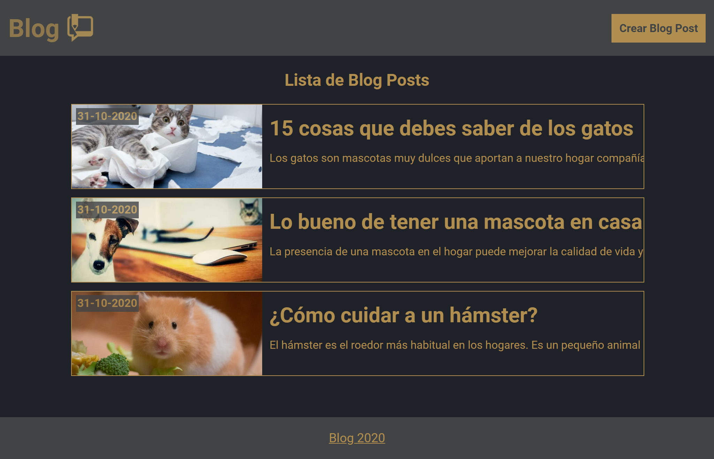
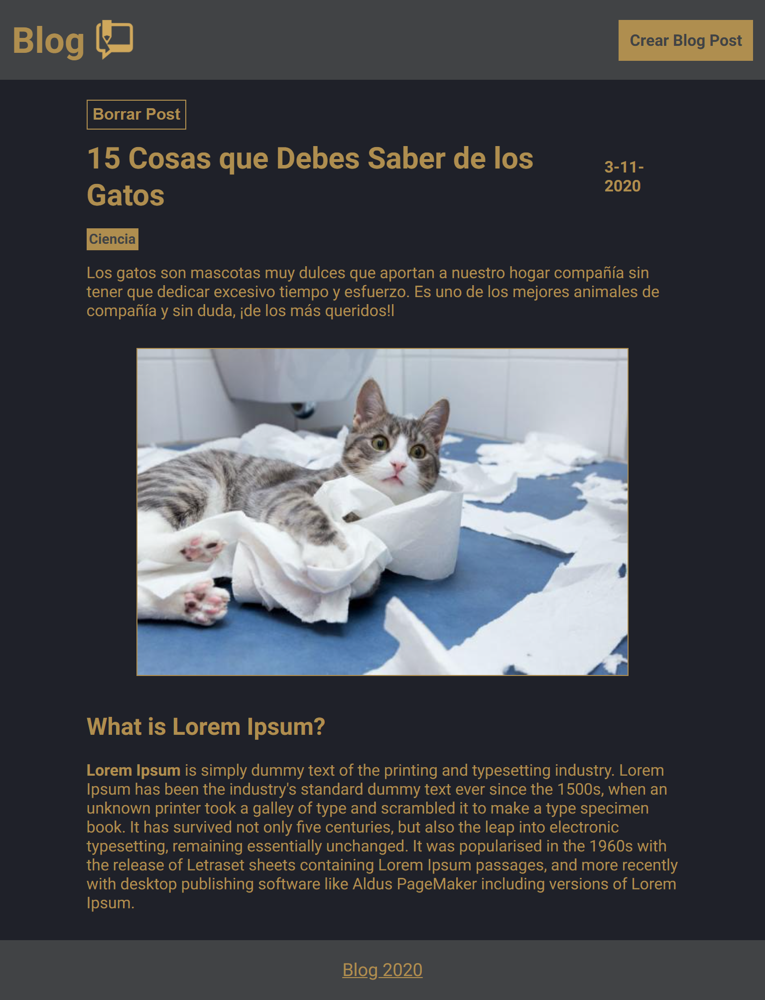
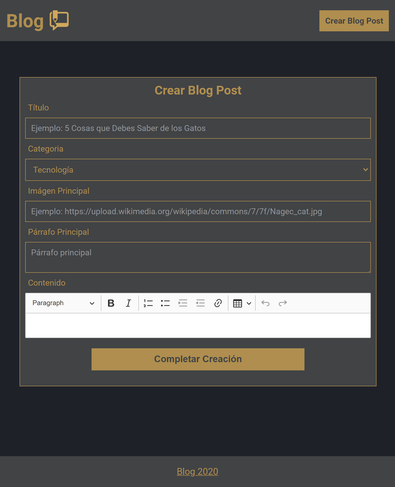

<h1 align="center">
    
   Blog Web App 
</h1>

  
  
  

Blog Web App Description

> Demo Web App: https://frontend-blog-ulzahk.vercel.app/

> Demo API: https://backend-blog-ulzahk.vercel.app/

## Table of Contents
- [Steps to Collaborate](#steps-to-collaborate)
- [Views](#views)
- [More Information](#more-information)
- [License](#license)

## Steps to Collaborate

1. Fork the project: by clicking the fork button (located at the top right corner)
2. Clone the project: `git clone https://github.com/<your username>/Frontend-Blog`
3. Install dependencies: `npm install` or use `npm i`
4. Create an .env file and use the .env.example file as a guide to fill in the environment variables.
5. Run the project: `npm run start`
6. Do the necessary improvements and make a commit: `git commit -am "<commit message>"` or use `git add .` and then `git commit -m "<commit message>"`
7. Upload changes to the repository created with the fork: `git push origin <branch name>`
8. Create a pull request to the original project.

## Views

### Blog Posts List

    

### Blog Posts Details

    

### Create Blog Post

    

## More Information

| Name                      | Link                                                                          |
| :-------------------------| :---------------------------------------------------------------------------- |
| Backend  Repository       | https://github.com/Ulzahk/Backend-Blog                                        |
| Blog API                  | https://backend-blog-ulzahk.vercel.app/                                       |

## License

[MIT License](https://github.com/Ulzahk/Frontend-Blog/blob/main/LICENSE)