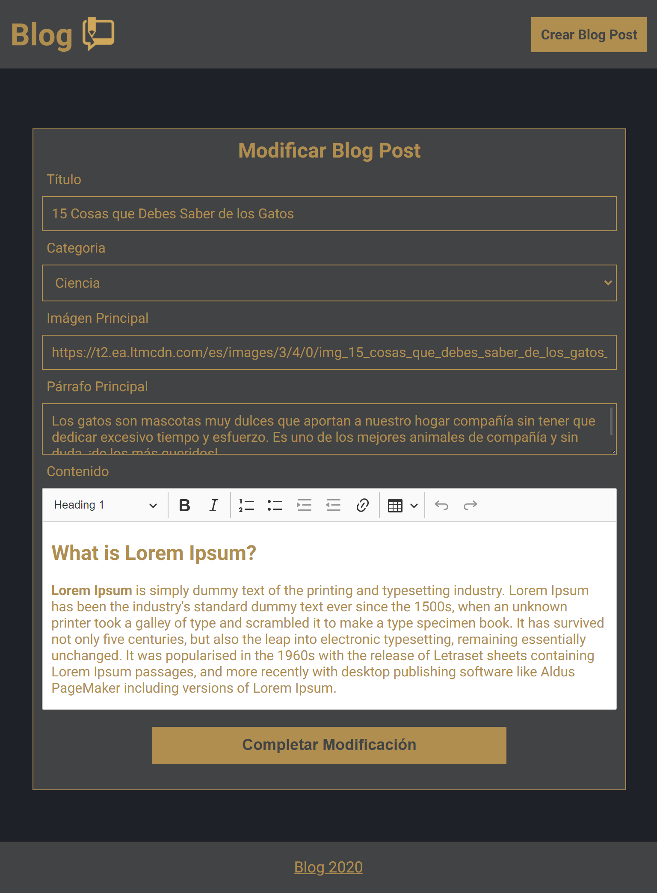

<h1 align="center">
    
   Blog Web App 
</h1>

  
  
  

Blog Web App is a basic system that allows you to create, read, modify and delete blog posts

> Demo Web App: https://frontend-blog-ulzahk.vercel.app/   
> Demo API: https://backend-blog-ulzahk.vercel.app/

## 📔 Commits Guidelines

- Using as reference [Conventional Commits](https://www.conventionalcommits.org/en/v1.0.0/)
- Every commit should have a sign with the contributor's GPG key
- The basic structure should be `[{ type in uppercase }] { description using imperative writing style or writing as a if it were a command }"`, for example:
  - `[UPDATE] header component with a new one more darker`
- For the types we have:
  - `[UPDATE]` : when we need to add a new feature, tests or change a property.
  - `[FIX]` : to implement the code necessary to fix a problem.
  - `[DELETE]` : when a file is going to be deleted and not replaced.
  - `[BREAKING CHANGE] or !` : to implement changes that are going to affect the integration with other services, for example:
    - `[UPDATE]! API version to v2 for new endpoints`

## 🤝 How to Contribute

1. Create a new branch using as base the `dev` branch.
2. Do the necessary improvements and make a commit: `git commit -S -am "{commit message}"` or use `git add .` and then `git commit -S -m "{commit message}"`.
3. Upload changes to the repository: `git push origin <branch name>`.
4. Create a pull request to the `dev` branch.
5. Wait for the code review and the merge.
6. Now your changes are in the dev environment.
7. After a review your changes are going to be merged to the `master` branch.
8. For certain contributors there are exeptions to these steps.

## 📲 Views

### Blog Posts List

    

### Blog Posts Details

    

### Create Blog Post

    

### Modify Blog Post

    

## 📚 More Information

| Name                      | Link                                                                          |
| :-------------------------| :---------------------------------------------------------------------------- |
| Backend  Repository       | https://github.com/Ulzahk/Backend-Blog                                        |
| Blog API                  | https://backend-blog-ulzahk.vercel.app/                                       |
